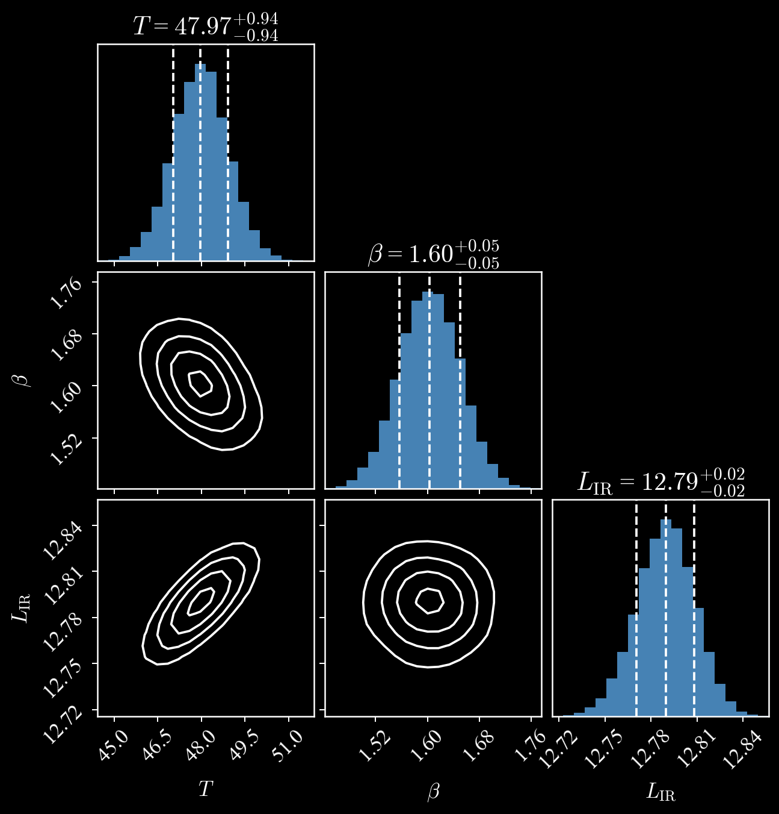

## Hi! I'm Stephen. 

### I enjoy coding a lot&mdash;both as a part of my PhD research and just for fun side projects.

I study some of the **dustiest, most distant galaxies** in the Universe. Most of my projects have to do with modeling these galaxies, measuring their brightnesses in images, and doing statistical data analysis on them. I mainly work in Python but enjoy learning new skills and languages (currently fiddling around with R and Julia, some web design, and machine learning techniques).

### Featured package: [mbb](https://github.com/sjmckay/mbb)

I made this package as a quick way to fit **modified blackbody (MBB) models** to a dusty galaxy's spectral energy distribution. More examples and documentation coming soon.

You can install mbb using `pip`... if you find it helpful, I'd love to know!

### Contact
sjmckay3 AT wisc DOT edu

